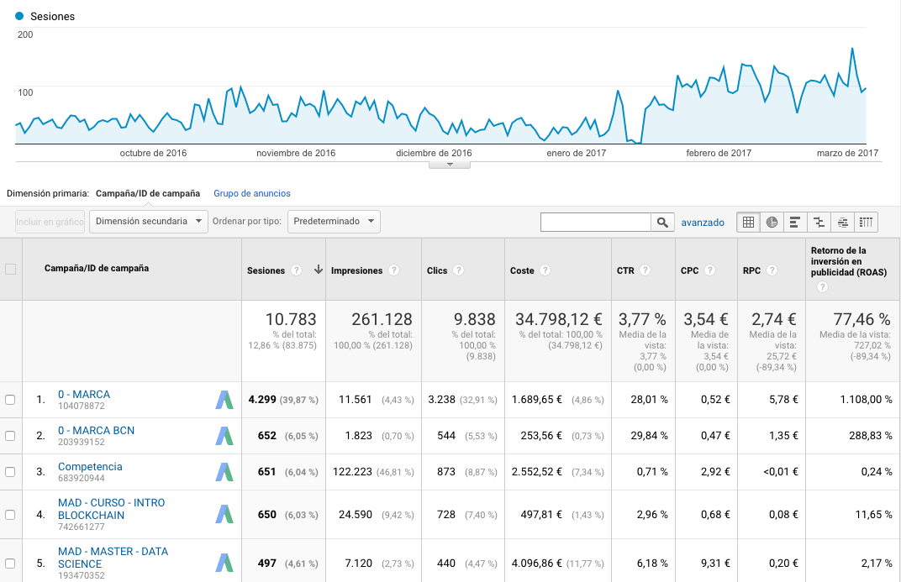
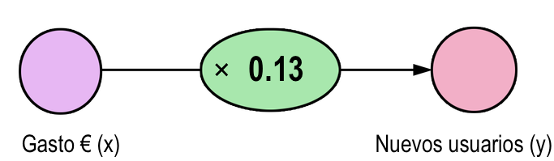

```{r setup, include=FALSE}
knitr::opts_chunk$set(echo = FALSE)
```


## Objetivo

- Analizar el rendimiento de las campañas de Google Adwords
- Saber si dichas campañas impactan en igual medida en usuarios nuevos como recurrentes.

## El origen de los datos 





## Cargamos las librerías necesarias

```{r message=FALSE, warning=FALSE, include=FALSE}

list.of.packages <- c("tidyverse", "tsoutliers", "lubridate", "devtools", "CausalImpact", "googleAnalyticsR", "ggrepel", "ggalt", "gridExtra", "broom", "knitr", "gplots", "revealjs")
new.packages <- list.of.packages[!(list.of.packages %in% installed.packages()[,"Package"])]
if(length(new.packages)) install.packages(new.packages)
lapply(list.of.packages, require, character.only = TRUE)

devtools::install_github("hrbrmstr/hrbrthemes")
library(hrbrthemes)
```


## Extracción de datos de Google Analytics

Objetivo:

- Extraemos datos mediante la API de Analytics
- Datos de usuarios `ga:users` y nuevos usuarios `ga:newUsers` dimensionados por fecha `ga:date` para todo el tráfico que viene a través de Google/CPC
 
```{r, message=FALSE, warning=FALSE, cache=TRUE}
ga_auth()
usuarios_desde_google_adwords <- google_analytics(id = "46728973",
                            start="2016-09-01", end="2017-03-05",
                            metrics = c("ga:users", "ga:newUsers"),
                            dimensions = c("ga:date"),
                            segment = c("sessions::condition::ga:sourceMedium=@google;ga:medium=@cpc"),
                            sort = c("ga:date"),
                            max=99999999, samplingLevel="HIGHER_PRECISION"
)
# usuarios_desde_google_adwords <- read_csv('data/usuarios_desde_google_adwords.csv')
knitr::kable(head(usuarios_desde_google_adwords))
```

## Usuarios recurrentes

Analytics no tiene una métrica `returningUsers` que nos facilite el número de **usuarios recurrentes**. 

```{r, echo=TRUE}
usuarios_desde_google_adwords <- usuarios_desde_google_adwords %>% 
  mutate(returningUsers = users - newUsers)

knitr::kable(head(usuarios_desde_google_adwords))
```

## Datos de costes

Cargamos el fichero con la inversión diaria realizada en pujas por palabras clave en Google Adwords.

```{r, message=FALSE, warning=FALSE, cache=T, cache=TRUE}
costes_google_adwords <- read_csv('data/costes_adwords.csv')
knitr::kable(head(costes_google_adwords))
```


## Unión de ambos conjuntos de datos

{.full}


## Unimos ambos data frames

1. Usuarios:

```{r}
knitr::kable(head(usuarios_desde_google_adwords, 2))
```

2. Costes:

```{r}
knitr::kable(head(costes_google_adwords, 2))
```

3. Usuarios y costes:

```{r, echo=TRUE}
usuarios_costes_google_adwords <- left_join(usuarios_desde_google_adwords, 
                                            costes_google_adwords, by="date")
```

```{r}
knitr::kable(head(usuarios_costes_google_adwords, 2))
```

## Análisis exploratorio inicial

```{r}
summary(usuarios_costes_google_adwords)
```

## Análisis descriptivo de una serie temporal

Todo análisis de serie temporal univariante, comienza con la presentación de un grafico donde se muestra la evolución de la variable a lo largo del tiempo.

```{r, fig.height=3, fig.width=5}
usuarios_costes_google_adwords %>% 
  ggplot(aes( x= date, y= newUsers)) + geom_line()

usuarios_costes_google_adwords %>% 
  ggplot(aes( x= date, y= returningUsers)) + geom_line()
```

¿Són similares ambas series?

## Análisis descriptivo de una serie temporal

¿Y ahora?

```{r, fig.height=3, fig.width=5}
usuarios_costes_google_adwords %>% 
  ggplot(aes( x= date, y= newUsers)) + 
  geom_line() +
  ylim(0,100)

usuarios_costes_google_adwords %>% 
  ggplot(aes( x= date, y= returningUsers)) + 
  geom_line() +
  ylim(0,100)
```

## Análisis descriptivo de una serie temporal

```{r, fig.height=8, fig.width=12}
usuarios_costes_google_adwords %>% 
  gather(key='metric', value="value", -date) %>% 
  filter(metric != "adCost") %>% 
  filter(metric != "users") %>% 
  ggplot(aes(x=date, y= value, color = metric)) + 
  geom_line() +
  scale_colour_manual(name = "",   values = c('newUsers'="#ffa700", 'returningUsers'="#008744"), labels = c("Usuarios nuevos", "Usuarios recurrentes")) +
  scale_x_date(labels = scales::date_format("%m/%Y"), breaks = scales::date_breaks("month"), date_minor_breaks = "1 week") +
  labs(title="Adquisición de usuarios", subtitle= "Evolución temporal del número de usuarios nuevos y recurrentes", caption = "Fuente Google Analytics") +
  xlab("") +
  ylab("Usuarios") +
  theme_ipsum_rc(grid='Y', axis=F, ticks = F) +
  theme( legend.position = "bottom")
```


## Métodos estadísticos 

- **Univariantes**: Estudian el comportamiento de una variable
- **Multivariantes**: Estudian el comportamiento de dos o más variables a la vez.
    - *Métodos de dependencia*: Dividen las variables en **dependientes** e **independientes** e intentan explicar si el conjunto de variables independientes afecta al conjunto de variables dependientes y de qué forma.
    - *Métodos de interdependencia*: **No** distinguen entre variables dependientes e independientes y su objetivo consiste en identificar qué variables están relacionadas, cómo lo están y por qué.
  
## ¿Univariante o multivariante?

```{r, echo=TRUE, fig.height=5, fig.width=10}
plot(density(usuarios_costes_google_adwords$returningUsers), 
     main="Usuarios recurrentes")
```

## ¿Univariante o multivariante?

```{r, echo=TRUE, fig.height=5, fig.width=10}
boxplot(usuarios_costes_google_adwords$returningUsers, 
        main="Usuarios recurrentes")
```

## ¿Univariante o multivariante?

```{r, fig.height=8, fig.width=12}
usuarios_costes_google_adwords %>% 
  gather(key='metric', value="value", -date) %>% 
  filter(metric == "returningUsers") %>% 
  ggplot(aes(x= metric, y=value)) + 
  geom_boxplot() +
  xlab("") +
  ylab("Usuarios") + 
  labs(title="Adquisición de usuarios", subtitle= "Distribución de frecuencias de usuarios recurrentes", caption = "Fuente Google Analytics")+
  theme_ipsum_rc(grid='Yy', axis=F, ticks = F, grid_col = "#eeeeee") +
  theme( legend.position = "bottom")
```

## ¿Univariante o multivariante?

```{r, echo=TRUE, fig.height=5, fig.width=10}
plot(usuarios_costes_google_adwords$adCost, usuarios_costes_google_adwords$newUsers, 
     main = "Adquisición e Inversión publicitaria")
```

## ¿Univariante o multivariante?

```{r, fig.height=8, fig.width=12}
usuarios_costes_google_adwords %>% 
  gather(key='metric', value="value", -date) %>% 
  filter(metric == "newUsers") %>% 
  ggplot(aes(x=date, y= value, color = metric)) + 
  geom_line() +
  scale_colour_manual(name = "",   values = c('newUsers'="#ffa700", 'returningUsers'="#008744"), labels = c("Usuarios nuevos", "Usuarios recurrentes")) +
  scale_x_date(labels = scales::date_format("%m/%Y"), breaks = scales::date_breaks("month"), date_minor_breaks = "1 week") +
  labs(title="Adquisición de usuarios", subtitle= "Evolución temporal del número de usuarios nuevos", caption = "Fuente Google Analytics") +
  xlab("") +
  ylab("Usuarios") +
  theme_ipsum_rc(grid='Y', axis=F, ticks = F) +
  theme( legend.position = "bottom")
```

## Preguntas a responder:

- ¿Exsite relación entre la *inversión* y el número de *nuevos usuarios* adquiridos?

- ¿Cómo de fuerte es la relación entre ambas variables?

- ¿Qué campaña contribuye más a la adquisición de nuevos usuarios?

- ¿Cón qué precisión podemos estimar el efecto de cada campaña?

- ¿Con qué seguridad podemos predecir el número de nuevos usuarios en el futuro?

- ¿Es una relación lineal?

## Modelos de regresión

¿Cómo influye la inversión en la adquisición?

```{r, echo=TRUE, fig.height=4, fig.width=6}
usuarios_costes_google_adwords %>%
  ggplot(aes(x = adCost, y = newUsers)) +
  geom_point(color = "orange", size = 3, alpha = 0.8) 
```

## Modelos de regresión

```{r, echo=TRUE, fig.height=4, fig.width=6, message=FALSE, warning=FALSE}
usuarios_costes_google_adwords %>%
  ggplot(aes(x = adCost, y = newUsers)) +
  geom_point(color = "orange", size = 3, alpha = 0.8) +
  geom_smooth()
```

## Modelo de regresión lineal

```{r, echo=TRUE, fig.height=4, fig.width=6}
usuarios_costes_google_adwords %>%
  ggplot(aes(x = adCost, y = newUsers)) +
  geom_point(color = "orange", size = 3, alpha = 0.8) +
  geom_smooth(method="lm")
```

## Variables

¿En qué variable podemos incidir para provocar un cambio en la otra variable?

- Llamemos `y` a nuestra variable dependiente o a explicar, `newUsers`
- Llamemos `x` a la variable independiente o explicativa, `adCost`

```{r, echo=TRUE}
y <- usuarios_costes_google_adwords$newUsers
x <- usuarios_costes_google_adwords$adCost
y[1:5]
x[1:5]
```

## EL modelo lineal más simple

¿Cuántos usuarios nuevos esperamos adquirir, si no tenemos en cuenta la inversión?

$$\hat y = \bar y$$

```{r, echo=TRUE}
mean(y)
```


```{r, echo=FALSE, fig.height=3, fig.width=5}
usuarios_costes_google_adwords %>%
  ggplot(aes(x = adCost, y = newUsers)) +
  geom_point(color = "orange", size = 3, alpha = 0.8) +
  geom_hline(aes(yintercept=mean(y)), color="blue", size=1.1)
```

## Debemos tener en cuenta la inversión

$$\hat y = f(x)$$

$$newUsers = f(adCost)$$

$$\hat y = \beta_0 + \beta_1(x)$$

## Correlación

$$ -1 < r < 1 $$

- Indica la fuerza y la dirección de una relación lineal
- La existencia de correlación no implica una relación lineal

```{r, echo=TRUE}
cor(x,y)
```

## Correlación

¿Es estadísticamente significativa la correlación entre $x$ e $y$?

```{r, echo=TRUE}
(ct <- cor.test(x, y))
```

El p-value es < .5 por lo que podemos rechazar $H_0$ (No existe correlación en la población) y afirmar que la correlación no es 0. El intervalo de confianza además es muy elevado indicando una fuerte correlación.

## CPA

¿Cuánto debo invertir para captar un nuevo usuario?

```{r}
knitr::kable(head(usuarios_costes_google_adwords %>% dplyr::select(newUsers, adCost),3), digits = 0)
```

Como primer instinto, el CPA o precio medio a pagar por nuevo usuario sería $y = f(x)$, $cpa = f(newUsers)$
Por lo tanto $y = \beta x$

A partir de los datos anteriores $  (152 + 161 + 128) / (19 + 24 + 13)  $

```{r, echo=TRUE}
(cpa <- sum(x[1:3]) / sum(y[1:3]) )
```

## CPA



- Coste de adquisición de un usuario $CPA = 7.89 * 1 (usuario)$

- Nuestro modelo final: $Usuarios = 1/7.89 * Gasto$

Este es un modelo predictivo muy simple. Toma un valor de entrada (gasto en euros), aplica una función (1/7.89 * gasto), y devuelve un resultado (Usuarios). 

Su nombre técnico: **modelo de regresión**.


## Un ejemplo

```{r}
muestra_de_x <- x[1:3]
muestra_de_y <- y[1:3]
pendiente_muestra <- sum(muestra_de_x * muestra_de_y) / sum(muestra_de_x^2)
cpa_medio <- (152 + 161 + 128) / (19 + 24 + 13)
cpa_medio <- sum(muestra_de_x) / sum(muestra_de_y)

# El CPA (un usuario)
(1/pendiente_muestra)

```
## 

```{r, fig.height=8, fig.width=12, cache=TRUE}
sub_titulo <- paste0("Coste por adquisición de un nuevo usuario: ", round(1/pendiente_muestra,2), "€")
ecuacion = paste0("Nuevos usuarios = ", round(pendiente_muestra,2), " * Inversión en €" )

ggplot() + geom_point(aes(x= muestra_de_x, y = muestra_de_y), color="#d62d20",size=3,alpha=0.8) + xlim(0,max(muestra_de_x)+10) + ylim(0,max(muestra_de_y)+5) + 
  geom_text(aes(x= c(152), y = c(19)), label=c("(152, 19)"), vjust=-2, hjust=1, color = "#666666") +
  geom_text(aes(x= c(161), y = c(24)), label=c("(161, 24)"), vjust=-2, hjust=.5, color = "#666666") +
  geom_text(aes(x= c(128), y = c(13)), label=c("(128, 13)"), vjust=2, hjust=.5, color = "#666666") +
  xlab("CPA (€)") +
  ylab("Nuevos usuarios") +
  geom_segment(aes(x = 152, y = 19, xend = 152, yend = 0), linetype=2, color = "#cccccc") +
  geom_segment(aes(x = 0, xend = 152, y = 19, yend = 19), linetype=2, color = "#cccccc") +
  geom_segment(aes(x = 161, y = 24, xend = 161, yend = 0), linetype=2, color = "#cccccc") +
  geom_segment(aes(x = 0, xend = 161, y = 24, yend = 24), linetype=2, color = "#cccccc") +
  geom_segment(aes(x = 128, y = 13, xend = 128, yend = 0), linetype=2, color = "#cccccc") +
  geom_segment(aes(x = 0, xend = 128, y = 13, yend = 13), linetype=2, color = "#cccccc") +  
  labs(title="Modelo predictivo simple", subtitle= sub_titulo, caption = ecuacion) +
  geom_abline(intercept = 0, slope = pendiente_muestra, color= "#0057e7",size=1.1)  +
  geom_abline(intercept = 0, slope = pendiente_muestra + .01, color= "#0057e7", alpha = .2)  +
  geom_abline(intercept = 0, slope = pendiente_muestra - .01, color= "#0057e7", alpha = .2)  +
  # geom_smooth(method="lm", se=FALSE, formula=y~x-1, aes(x= muestra_de_x, y = muestra_de_y) ) 
  # annotate("text", x = 120, y = 5, label = ecuacion, colour = "#3B3938", fontface =2) + 
  theme_ipsum_rc(grid=F, axis=T, ticks = T)
```

## Veammos ahora todos los datos

```{r, fig.height=8, fig.width=12, cache=TRUE}
pendiente <- coef(lm(newUsers ~ 0 + adCost, data = usuarios_costes_google_adwords))
sub_titulo <- paste0("Coste por adquisición de un nuevo usuario: ", round(1/pendiente,2), "€")
ecuacion = paste0("Nuevos usuarios = ", round(pendiente,2), " * Inversión en €" )

usuarios_costes_google_adwords %>% ggplot(aes( x= adCost, y= newUsers)) + geom_point(color="#ffa700",size=3,alpha=0.8) +
  geom_abline(intercept = 0, slope = pendiente, color= "#0057e7")  +
  labs(title="Modelo predictivo simple (Todos los datos)", subtitle= sub_titulo, caption = ecuacion) +
  # annotate("text", x = 20, y = 50, label = eq, colour = "red", fontface =2) +
  geom_smooth(method="lm", se=FALSE, formula=y~x-1) +
  theme_ipsum_rc(grid="XY")
```

## Modelo de regresión lineal en R

```{r, echo=TRUE}
new_users.lm <- lm(newUsers ~ adCost, data = usuarios_costes_google_adwords)
summary(new_users.lm)
```

## Modelo de regresión lineal en R

Los coeficientes del modelo

```{r, echo=TRUE}
(coeficientes <- coef(new_users.lm))
```

¿Término independiente?

## El término independiente $\beta_0$

$$\hat y = \beta_0 + \beta_1 x$$

```{r, fig.height=8, fig.width=12, cache=TRUE}
termino_independiente.lm <- coeficientes[1]
pendiente.lm <- coeficientes[2]

# EQ LM 
eq.lm = paste0("Nuevos usuarios = ", round(termino_independiente.lm,2), " + ", round(pendiente.lm,2), " * adCost" )

sub_titulo <- paste0("Coste por adquisición de un nuevo usuario: ", round(1/pendiente.lm,2), "€")

# Moviendo el término independiente
usuarios_costes_google_adwords %>% ggplot(aes( x= adCost, y= newUsers)) + geom_point(color="#ffa700",size=3,alpha=0.8) +
  geom_abline(intercept = termino_independiente.lm, slope = pendiente.lm, color= "#0057e7",size=1.4) +
  geom_abline(intercept = termino_independiente.lm + 2 , slope = pendiente.lm, color= "#0057e7", alpha = .8) +
  geom_abline(intercept = termino_independiente.lm - 2 , slope = pendiente.lm, color= "#0057e7", alpha = .8) + 
  geom_abline(intercept = termino_independiente.lm + 4 , slope = pendiente.lm, color= "#0057e7", alpha = .2) +
  geom_abline(intercept = termino_independiente.lm - 4 , slope = pendiente.lm, color= "#0057e7", alpha = .2) +   
  labs(title="Modelo de regresión lineal", subtitle= sub_titulo, caption = eq.lm) +
  theme_ipsum_rc()
```

## Poniendo a prueba el modelo

- Aplicando la funcion `predict` obtenemos el punto sobre la recta para cada valor de la variable independiente (adCost)

```{r, echo=TRUE}
# Obtain predicted and residual values
usuarios_costes_google_adwords$predicted <- predict(new_users.lm)
usuarios_costes_google_adwords$residuals<- residuals(new_users.lm)
```

```{r}
knitr::kable(head( usuarios_costes_google_adwords %>% dplyr::select(adCost, newUsers, predicted, residuals) , 3 ), digits = 2)
```

## 

```{r, fig.height=8, fig.width=12, cache=TRUE}
usuarios_costes_google_adwords %>% ggplot(aes( x= adCost, y= newUsers)) + geom_point(color="#ffa700",size=3,alpha=0.8) +
  geom_point(aes(y = predicted), color= "#0057e7",size=3,alpha=0.8) +
  geom_segment(aes(xend = adCost, yend = predicted), alpha = .2) +
  # annotate("text", x = 20, y = 50, label = eq, colour = "red", fontface =2) +
  labs(title="Modelo de regresión lineal", subtitle= "Errores del modelo", caption = eq.lm) +
  theme_ipsum_rc(grid=F, axis=T, ticks = F)
```

## Errores del modelo

- RMSE: Mide la desviación de la estimación a los valores reales y está en la misma unidad que la variable dependiente y es el criterio más importante para evaluar si es un modelo predictivo válido.

$$MSE=\frac{1}{n} \sum_{i=1}^n (y_i - \hat{y}_i)^2$$

$$RMSE=\sqrt{MSE}$$

- El modelo puede predecir el número de usuarios nuevos con un error medio de: 

```{r, echo=TRUE}
(mean((usuarios_costes_google_adwords$newUsers - usuarios_costes_google_adwords$predicted)^2))^0.5 
summary(new_users.lm)$sigma
```

## Intervalos de confianza

```{r, echo=TRUE}
confint(new_users.lm)
```

- Por cada euro invertido en CPC, tengo una certeza del 95% de que seré capar de captar entre 0.16  y 0.18 nuevos usuarios
- Igualmente el término independiente estará entre 1.42 y 6.19 (95% de confianza)

## 

```{r, fig.height=8, fig.width=12, message=FALSE, warning=FALSE, cache=TRUE}
predicciones <- as_data_frame(predict(new_users.lm, interval='prediction'))

datos_con_intervalos_de_confianza <- cbind(usuarios_costes_google_adwords, 
                                           predicciones)

datos_con_intervalos_de_confianza$fuera_intervalo <-
  ifelse(
    usuarios_costes_google_adwords$newUsers <= predicciones$lwr,
    T,
    ifelse(usuarios_costes_google_adwords$newUsers >= predicciones$upr, T, F)
  )

datos_con_intervalos_de_confianza %>% ggplot(aes(adCost, newUsers))+
  geom_point(aes(colour=factor(fuera_intervalo))) +
  scale_colour_manual(name = "",   values = c('TRUE'="#d62d20", 'FALSE'="#cccccc"), labels = c("Dentro del intervalo", "Fuera del intervalo")) +
  geom_text_repel(data=subset(datos_con_intervalos_de_confianza, fuera_intervalo == T),  aes(x=adCost, y=newUsers, label = factor(date)), color = '#0057e7' )  +
  # geom_text(aes(x= c(19), y = c(152)), label=c("(19, 152)"), vjust=-.5) +
  geom_line(aes(y=lwr), color = "#d62d20", linetype = "dashed")+
  geom_line(aes(y=upr), color = "#d62d20", linetype = "dashed")+
  geom_smooth(method=lm, se=TRUE, color='#0057e7')  +
  # annotate("text", x = 20, y = 50, label = eq, colour = "red", fontface =2) +
  labs(title="Modelo de regresión lineal", subtitle= "Intervalo de confianza de las predicciones", caption = eq.lm) +
  theme_ipsum_rc(grid=F, axis=T, ticks = T) +theme( legend.position = "bottom")
```


## Aplicación predictiva del modelo

- Hasta ahora hemos utilizado el modelo como descriptivo. 

```{r, echo=TRUE}
posibles_inversiones <- data.frame(adCost=c(50, 320))
```

```{r}
knitr::kable(head(posibles_inversiones))
```


- Usaremos la función `predict()` ahora con nuevos datos

```{r, echo=TRUE}
predicciones <- as.data.frame(
  predict(object = new_users.lm, 
          newdata = posibles_inversiones , 
          interval='prediction')
  )

predicciones <- cbind(posibles_inversiones,predicciones)
```

```{r}
knitr::kable(predicciones)
```


##

```{r, fig.height=8, fig.width=12, message=FALSE, warning=FALSE, cache=TRUE}
ggplot() + 
  geom_point(data = usuarios_costes_google_adwords, aes( x= adCost, y= newUsers)) +
  geom_point(data = predicciones, aes(x = adCost, y=fit), color= "#d62d20",size=7,alpha=.8, shape=19 ) +
  geom_errorbar(data = predicciones, aes(x=adCost, y=fit, ymin=lwr,ymax=upr,width=0.5), color="#d62d20") +
  geom_label_repel(data=predicciones,  aes(x=adCost, y=fit, label = round(fit,0)), color = '#0057e7' , box.padding = unit(1.55, "lines"),point.padding = unit(0.5, "lines"), segment.color = '#666666') +
  labs(title="Modelo de regresión lineal", subtitle= "Predicciones del modelo", caption = eq.lm) +
  theme_ipsum_rc(grid=F, axis=T, ticks = F)
```


## Ejercicio

Haz una regresión lineal que explique la influencia del gasto publicitario sobre los usuarios recurrentes. Compara los resultados con el anterior modelo.

- ¿En que usuarios produce más efecto la inversión en Adwords?

```{r, eval=FALSE, include=FALSE}
returning_users.lm <- lm(returningUsers ~ adCost, data = ga_data)

summary(returning_users.lm)

coef(returning_users.lm)

coef(new_users.lm)[2] > coef(returning_users.lm)[2]
```


# Impacto de las campañas por tipo de usuario

Queremos constatar que las campañas presentan un comportamiento diferente en cuanto al número de usuarios nuevos y recurrentes. 

Si ambas atraen tanto a nuevos y recurrentes por igual esto puede indicar que estamos en una situación de canibalización e impactamos y tenemos a usuarios que ya nos conocen haciendo click en nuestros anuncios.


```{r, echo=TRUE}
new_and_returning_averages <- usuarios_costes_google_adwords %>% 
  summarise(avg_newUsers = mean(newUsers), avg_returningUsers = mean(returningUsers))
```

Media de usuario nuevos y recurrentes

```{r}
knitr::kable(new_and_returning_averages)
```

## Visualizamos las distribuciones de ambos tipos de usuarios

```{r, echo=TRUE, fig.height=4, fig.width=5}
old.par <- par(mfrow=c(1, 1))
par(mfrow=c(1, 2))
plot(density(usuarios_desde_google_adwords$newUsers), main="newUsers")
plot(density(usuarios_desde_google_adwords$returningUsers) , main = "returningUsers")
par(old.par)
```

> ¿Podemos comparar ambos distribuciones con los gráficos anteriores?

## 

```{r, fig.height=8, fig.width=12, message=FALSE, warning=FALSE, cache=TRUE}
usuarios_desde_google_adwords %>% 
  gather(key='dimension', value="metric", -date, -users) %>% 
  ggplot(aes(x=metric, color=dimension)) + 
  geom_density(aes(fill=dimension), size=0, alpha=.8, color="red") +
  scale_fill_manual(name = "", values = c('newUsers'="#2196F3", 'returningUsers'="#3F51B5"), labels = c("Nuevos Usuarios", "Usuarios Recurrentes")) +
  xlab("") +
  ylab("# usuarios") + 
  labs(title="Curvas de distribución por tipo de usuario", subtitle= "Curvas de distribución por tipo de usuario", caption = "Fuente: Google Analytics") +
  theme_ipsum_rc(grid='Y', axis=F, ticks = F, grid_col = "#eeeeee") +theme( legend.position = "bottom")
```

## Visualizamos las distribuciones de ambos tipos de usuarios

```{r, echo=TRUE, fig.height=4, fig.width=5}
par(mfrow=c(1, 2))
boxplot(usuarios_desde_google_adwords$newUsers)
boxplot(usuarios_desde_google_adwords$returningUsers)
par(old.par)
```

##

```{r, fig.height=8, fig.width=12, message=FALSE, warning=FALSE, cache=TRUE}
usuarios_desde_google_adwords %>% 
  gather(key='metric', value="value", -date, -users) %>% 
  ggplot(aes(x= metric, y = value)) + geom_boxplot() +
  xlab("") +
  ylab("# usuarios") + 
  labs(title="Media de usuarios por tipo", subtitle= "", caption = "Fuente: Google Analytics") +
  theme_ipsum_rc(grid='Y', axis=F, ticks = F, grid_col = "#eeeeee") +theme( legend.position = "bottom")
```

## Test de Student

- Se aplica para comprobar que la media de dos poblaciones (usuarios nuevos y recurrentes) son iguales. 
- Si así fuera estaríamos impactando con la campañas al mismo grupo de usuarios.

```{r}
t.test(usuarios_desde_google_adwords$newUsers, usuarios_desde_google_adwords$returningUsers)
```

El p-valor es menor que 0.5 por lo cual rechazamos la hipótesis nula $H_0$ de que las medias son iguales.

# Series temporales

- Una serie temporal es una secuencia de datos, observaciones o valores, medidos en determinados momentos y ordenados cronológicamente.

- En el análisis de las series temporales se usan métodos que ayudan a interpretarlas así como a predecir su evolución

## Convertir un vector a una serie temporal

Lo hacemos con la función `ts()` aunque hay más.

```{r, echo=TRUE}
new_users.ts <- ts(usuarios_desde_google_adwords$newUsers, 
                   frequency = 365, 
                   start = decimal_date( ymd( min( usuarios_desde_google_adwords$date ) ) ) )
```

```{r}
new_users.ts
```

## Visualización de un serie

```{r, fig.height=8, fig.width=12, message=FALSE, warning=FALSE}
plot(new_users.ts, main="Nuevos usuarios")
```

## Detección de puntos de interés

```{r, echo=TRUE}
new_users.ts.fit <- tsoutliers::tso(new_users.ts, 
                                    types = c("AO","LS","TC","IO"),
                                    maxit.iloop=20, 
                                    tsmethod = "auto.arima")
new_users.ts.fit
```

##
```{r, echo=TRUE, fig.height=8, fig.width=12, message=FALSE, warning=FALSE}
plot(new_users.ts.fit)
```

##

```{r, fig.height=8, fig.width=12, message=FALSE, warning=FALSE}
new_users_outliers <- as_data_frame(new_users.ts.fit$outliers)
new_users_outliers$date <- as.Date(new_users_outliers$time,format='%Y:%j')

new_users_outliers <- left_join(usuarios_desde_google_adwords,
                                new_users_outliers)

outliers.sub <- subset(new_users_outliers, type != "")
outliers.sub2 <- subset(outliers.sub, type != "AO")
new_users_outliers %>% ggplot(aes( x= date, y= newUsers)) + geom_xspline(color="#cccccc", spline_shape=-0.4, size=0.5) +
  geom_point(data=subset(new_users_outliers, type != ""), aes(x=date ,y= newUsers, color = factor(type)),size=3,alpha=0.95) +
  geom_label_repel(data=outliers.sub,  aes(x=date, y=newUsers, label = factor(type)), box.padding = unit(1.55, "lines"),point.padding = unit(0.5, "lines"), segment.color = '#666666') +
  geom_encircle(data=outliers.sub2, colour="#d62d20", expand=0.1) +
  # scale_color_discrete(name = 'type') +
  scale_colour_manual(name = "",   values = c('IO'="#ffa700", 'LS'="#008744", 'AO'="#d62d20"), labels = c("IO: Punto precursor del cambio", "AO: Extremo", "LS: Cambio de nivel")) +
  scale_x_date(labels = scales::date_format("%m/%Y"), breaks = scales::date_breaks("month"), date_minor_breaks = "1 week") +
  xlab("") +
  ylim(0,150) +
  ylab("# Nuevos usuarios") + 
  labs(title="Evolución de la adquisición de nuevos usuarios", subtitle= "Puntos de interés", caption = "Fuente: Google Analytics") +
  theme_ipsum_rc(grid='x', axis=F, ticks = F, grid_col = "#eeeeee") +theme( legend.position = "bottom")
```

## Causal Impact

- El 2017-01-24 se cambian las creatividades de todas las campañas 
- La invesión y las palabras claves se mantienen inalterables 
- Todas las campañas mantienen su etiquetado original

**¿Ha supuesto este cambio algún impacto en nuestra captación de nuevos usuarios?**

```{r, echo=TRUE, cache=T}
pre.period <- as.Date(c("2016-09-01", "2017-01-23"))
post.period <- as.Date(c("2017-01-24", "2017-03-05"))

impact <- CausalImpact(usuarios_desde_google_adwords %>% dplyr::select(date, newUsers), 
                       pre.period, 
                       post.period)
```

## Causal Impact

```{r, fig.height=8, fig.width=12, message=FALSE, warning=FALSE}
plot(impact)
```

## Causal Impact

**¿Podemos cuantificarlo?**

```{r}
summary(impact, "report")
```

# Análisis individualizado de las campañas

- Vamos a analizar en detalle el rendimiento de las campañas de Google Adwords
- Seguimos teniendo como variable objetivo los **nuevos usuarios**
- Realizaremos un análisis descriptivo que trate de explicar que campañas funcionan mejor y cuales peor.

## Obtención de nuevos datos

- Extrar de Google Analytics las métricas `ga:users`, `ga:newUsers` y `ga:bounces` dimensionadas por fecha y campaña

```{r, echo=TRUE, message=FALSE, warning=FALSE, cache=T}
ga_auth()
google_adwords_metricas <- google_analytics(id = "46728973",
                            start="2016-09-01", end="2017-03-05",
                            metrics = c("ga:users", "ga:newUsers", "ga:bounces"),
                            dimensions = c("ga:date, ga:campaign"),
                            segment = c("sessions::condition::ga:sourceMedium=@google;ga:medium=@cpc"),
                            sort = c("ga:date"),
                            max=99999999, 
                            samplingLevel="HIGHER_PRECISION"
)

knitr::kable(head(google_adwords_metricas))
```

## Datos de costes

```{r, echo=TRUE, message=FALSE, warning=FALSE, cache=T}

costes_por_campana <- read_csv('data/costes_por_campana.csv')

knitr::kable(head(costes_por_campana))
```

## Primera inspección a los datos

¿Hay datos llamativos?

```{r, echo=TRUE}
summary(google_adwords_metricas)
```

```{r, echo=TRUE}
summary(costes_por_campana)
```

## Uníon de ambos conjuntos de datos

```{r, echo=TRUE}
campanas <- left_join(google_adwords_metricas, costes_por_campana, by = c("date", "campaign"))
```

Descubrimos ya la presencia de errores de medición:

```{r}
knitr::kable(head(campanas))
```


## Tratamiento de datos

- Nos han pedido que centremos el análisis en campañas sobre cursos y masters por lo que descartamos las demás
- Además, nos intersea tener una variable para la ciudad, el tipo de programa y el nombre del curso o máster

```{r, echo=TRUE}
campanas <- campanas %>%  
  filter(!grepl("MARCA|Competencia|(not set)", campaign)) %>% 
  separate(campaign, c("ciudad", "programa", "nombre"), " - ") %>% 
  mutate(ctr = round(adClicks / impressions,2)) 
```


```{r}
knitr::kable(head(campanas))
```

## Tratamiento de datos

Comprobamos la existencia de valores nulos

```{r}
summary(campanas)
```

Son NA generados por la ausencia de datos en el dataset `costes_por_campana`.

## Tratamiento de datos: Omitimos los nulos.

```{r, echo=TRUE}
campanas <- campanas %>% na.omit
```

```{r}
summary(campanas)
```


## Análisis exploratorio: CPC

```{r, fig.height=8, fig.width=12, message=FALSE, warning=FALSE}
campanas %>% ggplot(aes(x=nombre, y=cpc, color=programa)) + geom_boxplot() + facet_wrap(~ciudad) + coord_flip() +
  xlab("") +
  ylab("# usuarios") + 
  labs(title="Inversión en Adwords", subtitle= "Distribución del CPC por curso", caption = "Fuente: Google Analytics") +
  theme_ipsum_rc(grid='Y', axis=F, ticks = F, grid_col = "#eeeeee") +theme( legend.position = "bottom")
```

## Análisis exploratorio: Abandonos

```{r, fig.height=8, fig.width=12, message=FALSE, warning=FALSE}
campanas %>%  mutate(returningUsers = users - newUsers) %>% group_by(programa, nombre) %>% 
  summarise(newUsers = sum(newUsers), returningUsers = sum(returningUsers), users = sum(users), adCost=sum(adCost, na.rm=T), bounces=sum(bounces)) %>% ggplot(aes(x=adCost, y=bounces, color=programa)) + geom_point(aes(size = users)) + 
  geom_text_repel(aes(label = factor(nombre)), color = '#212121' ,box.padding = unit(0.55, "lines")) + 
  # geom_label_repel(aes(label = factor(nombre)), box.padding = unit(.55, "lines"),point.padding = unit(0.5, "lines"), segment.color = '#666666') +
  # scale_color_discrete(name = 'nombre') 
  scale_colour_manual(name = "nombre",   values = c("#ffa700", "#008744", "#d62d20")) +
  xlab("Inversión publicitaria") +
  ylab("Rebotes") + 
  labs(title="Análisis de abandonos", subtitle= "", caption = "Fuente: Google Analytics") +
  theme_ipsum_rc(grid='', axis=F, ticks = F, grid_col = "#eeeeee") +theme( legend.position = "bottom")
```

## Análisis exploratorio CTR

```{r, fig.height=8, fig.width=12, message=FALSE, warning=FALSE}
campanas %>% ggplot(aes(x=reorder(factor(nombre),ctr), y=ctr)) + geom_boxplot(aes(color=programa)) + coord_flip() +
  xlab("") +
  ylab("CTR") + 
  labs(title="Click Through Rates", subtitle= "CTR por campaña", caption = "Fuente: Google Analytics") +
  theme_ipsum_rc(grid='Xx', axis=T, ticks = F, grid_col = "#eeeeee") +theme( legend.position = "bottom")
```


## Análisis exploratorio: Inversión

```{r, fig.height=8, fig.width=12, message=FALSE, warning=FALSE}
campanas %>%  mutate(returningUsers = users - newUsers) %>% group_by(programa, nombre) %>% 
summarise(newUsers = sum(newUsers), returningUsers = sum(returningUsers), users = sum(users), adCost=sum(adCost, na.rm=T), bounces=sum(bounces)) %>% ggplot(aes(x=adCost, y=newUsers, color=programa)) + geom_point(aes(size = users)) + 
  geom_text_repel(aes(label = factor(nombre)), color = '#212121' ,box.padding = unit(0.55, "lines")) + 
  # geom_label_repel(aes(label = factor(nombre)), box.padding = unit(.55, "lines"),point.padding = unit(0.5, "lines"), segment.color = '#666666') +
  # scale_color_discrete(name = 'nombre') 
  scale_colour_manual(name = "nombre",   values = c("#ffa700", "#008744", "#d62d20")) +
  xlab("Inversión publicitaria") +
  ylab("# Nuevos usuarios") + 
  labs(title="Análisis de la captación", subtitle= "", caption = "Fuente: Google Analytics") +
  theme_ipsum_rc(grid='', axis=F, ticks = F, grid_col = "#eeeeee") +theme( legend.position = "bottom")
```

## Regresión lineal múltiple

```{r}
campanas_adwords.fit <- lm(newUsers ~  0 + adCost + nombre, data=campanas)
summary(campanas_adwords.fit)
```


```{r, fig.height=8, fig.width=12, message=FALSE, warning=FALSE}
campanas_adwords_res <- tidy(campanas_adwords.fit)
r.squared <- glance(campanas_adwords.fit)$r.squared
campanas_adwords_res$term <- tolower(campanas_adwords_res$term)

trim <- function (x) gsub("^campaign", "", x)
campanas_adwords_res$term <- trim(campanas_adwords_res$term )

mejores_campanas <- subset(campanas_adwords_res, estimate > 0)
peores_campanas <- subset(campanas_adwords_res, estimate <= 0)

ggplot( ) +
  geom_lollipop(data = campanas_adwords_res, aes(y=reorder(term, estimate), x=estimate), point.colour="#008744", point.size=2, horizontal=TRUE, color="#cccccc", alpha=.9) +
  geom_lollipop(data = peores_campanas, aes(y=reorder(term, estimate), x=estimate), point.colour="#d62d20", point.size=2, horizontal=TRUE, color="#cccccc", alpha=.9) +
  labs(title="Modelo de regresión lineal múltiple", subtitle= "Peso de las campañas", caption = "Cada punto representa el peso relativo de cada campaña a la hora de captar nuevos usuarios.") +
  xlab(expression(paste("Coeficientes ", beta))) +
  ylab("") +
  theme_ipsum_rc(grid=F, axis=T, ticks = F)

```


## ANOVA

```{r, echo=TRUE}
plotmeans(newUsers ~ ciudad, data=campanas, digits=2, ccol='red', mean.labels=T, main="Plot of breast cancer means by continent")
```

```{r, echo=TRUE}
aov_campanas <- aov(campanas$newUsers ~ campanas$ciudad)
summary(aov_campanas)
```

El p-valor es menor que .05, por lo que aceptamos la hipótesis $H_1$ the que hay una relación significativa entre cada ciudad y la captación de nuevos usuarios.

## Comparando la medias

EL test de Tukey

```{r, echo=TRUE}
(tukey <- TukeyHSD(aov_campanas))
```

Un p-valor < .05 indica que hay una diferencia significativa entre ambas ciudades. Si es mayor, que no la hay.

##  

Los líneas que no contienen el 0 representan aquellas ciudades en las que hay diferencias significativas.

```{r, echo=TRUE}
plot(tukey)
```

```{r, fig.height=8, fig.width=12, message=FALSE, warning=FALSE}
tky = as.data.frame(tukey$`campanas$ciudad`)
tky$pair = rownames(tky)

# Plot pairwise TukeyHSD comparisons and color by significance level
ggplot(tky, aes(colour=cut(`p adj`, c(0, 0.01, 0.05, 1), 
                           label=c("p<0.01","p<0.05","Non-Sig")))) +
  geom_hline(yintercept=0, lty="11", colour="grey30") +
  geom_errorbar(aes(pair, ymin=lwr, ymax=upr), width=0.2) +
  geom_point(aes(pair, diff)) +
  labs(colour="") + coord_flip() +
  xlab("") +
  ylab("") + 
  labs(title="Adquisción media de usuarios por área", subtitle= "En verde y rojo aquellas áreas con diferencias significativas", caption = "Intervalos de confianza de Tukey con niveles de confianza individuales de 95%") +
  theme_ipsum_rc(grid='Xx', axis=T, ticks = F, grid_col = "#eeeeee") +theme( legend.position = "bottom")

```

## Comparación de dos medias

```{r echo =T}
masters_aw_ds <- campanas %>% 
  dplyr::filter(nombre %in% c("ANALITICA WEB" , "DATA SCIENCE"))

masters_aw_ds <- masters_aw_ds %>% 
  mutate(ctr = adClicks / impressions) 

masters_aw_ds %>% 
  group_by(nombre) %>% 
  summarise(avg_ctr = mean(ctr, na.rm = T))
```

```{r}
knitr::kable(head(masters_aw_ds %>% group_by(nombre) %>% summarise(avg_ctr = mean(ctr, na.rm = T))))
```

##

```{r, fig.height=8, fig.width=12, message=FALSE, warning=FALSE}
masters_aw_ds %>% ggplot(aes(x=reorder(factor(nombre),ctr), y=ctr)) + geom_boxplot(color="#2196F3") + 
  xlab("") +
  ylab("CTR") + 
  labs(title="Comparativa de medias de Click Through Rates", subtitle= "¿Podemos afirmar que los anuncios de #DataScience tienen un CTR menor que los de #AnaliticaWeb?\n", caption = "-¿Son las creatividades o los textos para AW más impactantes?\n-¿Son los futuros científicos de datos menos propensos a realizar click?\n-¿Es más fuerte la competencia en Adwords para DS que para AW?") +
  theme_ipsum_rc(grid='Yy', axis=F, ticks = F, grid_col = "#eeeeee") +theme( legend.position = "bottom")
```

## Extraremos los vectores

```{r echo=T}
# Vectores
ctr_aw <- masters_aw_ds %>% 
  filter(nombre == "ANALITICA WEB") %>% 
  dplyr::select(ctr) %>% unlist()

ctr_ds <- masters_aw_ds %>% 
  filter(nombre == "DATA SCIENCE") %>% 
  dplyr::select(ctr) %>% unlist()
```

```{r, fig.height=8, fig.width=12, message=FALSE, warning=FALSE}
par(mfrow=c(1, 2))
plot(density(ctr_aw, na.rm = T), main="Analítica web")
plot(density(ctr_ds, na.rm = T), main="Data Science")
par(old.par)
```

## 
```{r}
masters_aw_ds %>% dplyr::select(nombre, ctr) %>%  gather(key='nombre', value="ctr") %>% ggplot(aes(x=ctr, color=nombre)) + geom_density(aes(fill=nombre), size=0, alpha=.9, color="red") +
  scale_fill_manual(name = "", values = c('ANALITICA WEB'="#CCCCCC", 'DATA SCIENCE'="#0057e7"), labels = c("ANALITICA WEB", "DATA SCIENCE")) +
  xlab("") +
  ylab("# usuarios") + 
  labs(title="CTR medio por master", subtitle= "", caption = "Fuente: Google Analytics") +
  theme_ipsum_rc(grid='Y', axis=F, ticks = F, grid_col = "#eeeeee") +theme( legend.position = "bottom")
```

## Medidas de centralidad y dispersión

```{r, echo=TRUE}
mean(ctr_aw, na.rm = T)
mean(ctr_ds, na.rm = T)

var(ctr_aw, na.rm = T);
var(ctr_ds, na.rm = T)

sd(ctr_aw, na.rm = T)
sd(ctr_ds, na.rm = T)
```

## Test de la varianza

```{r, echo=TRUE}
var.test(ctr_aw,ctr_ds)
```

El p-value < 0.05 implica rechazar H0 y por lo tanto ambas varianzas no son iguales. (La variazión de CTR es disinto para cada campaña).

## Test de normalidad de los datos

```{r}
shapiro.test(ctr_aw); shapiro.test(ctr_ds)
```

En ambos casos el p-value es menor que 0.05 , por lo que rechazamos la hipótesis nula de que el CTR sigue una distribución normal en ambos grupos de usuarios.

Debido a esto no podemos aplicar un `t.test(ctr_aw, ctr_ds)`

## Teste de Wilcox
```{r, echo=TRUE}
wilcox.test(ctr_aw, ctr_ds)
```

Como el p-value < 0.5, rechazamos la hipótesis nula y por lo tanto ambas poblaciones (camapañas) son disintas.


