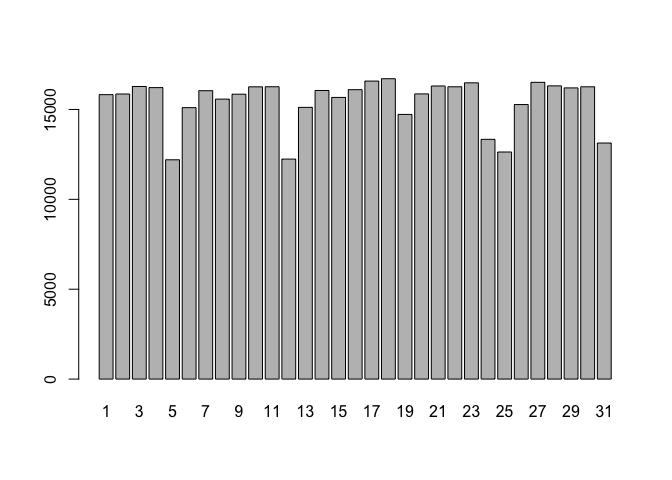
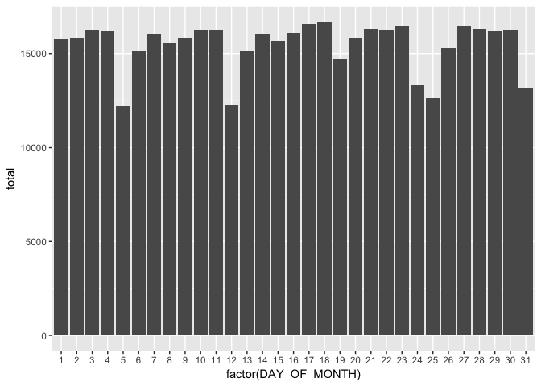
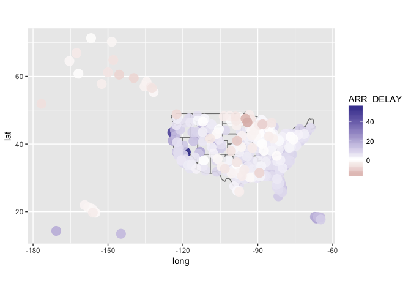

Manipulación de datos en R con dplyr
================
@jrcajide

``` r
# Cargamos la librerías necesarias
list.of.packages <- c("tidyverse")
new.packages <- list.of.packages[!(list.of.packages %in% installed.packages()[,"Package"])]
if(length(new.packages)) install.packages(new.packages)
lapply(list.of.packages, require, character.only = TRUE)
```

    ## Loading required package: tidyverse

    ## Warning: package 'tidyverse' was built under R version 3.3.2

    ## Loading tidyverse: ggplot2
    ## Loading tidyverse: tibble
    ## Loading tidyverse: tidyr
    ## Loading tidyverse: readr
    ## Loading tidyverse: purrr
    ## Loading tidyverse: dplyr

    ## Warning: package 'ggplot2' was built under R version 3.3.2

    ## Conflicts with tidy packages ----------------------------------------------

    ## filter(): dplyr, stats
    ## lag():    dplyr, stats

    ## [[1]]
    ## [1] TRUE

¿Porqué dplyr?
--------------

-   Facilita enormemente el análisis exploratorio de datos así como su transformación
-   Muy intituitiva, debido sobre todo al uso de pipes: `%>%`
-   Muy rápida incluso con grandes datasets

Funcionalidades
---------------

-   5 verbos básicos: `filter`, `select`, `arrange`, `mutate`, `summarise` (y `group_by`)
-   Puede trabjar con datos almacenados en en bases de datos o en [data tables](http://datatable.r-forge.r-project.org/)
-   Joins: inner join, left join, semi-join, etc.
-   Funciones para cálculo de rankings, evoluciones, etc.

Cargando dplyr y el conjunto de datos
-------------------------------------

-   Echemos un vistado a los datos [Flights](http://www.transtats.bts.gov/DL_SelectFields.asp?Table_ID=236&DB_Short_Name=On-Time)
-   Con `tbl_df` convertiremos los datos a "local data frame"

``` r
suppressMessages(library(dplyr))
library(ggplot2)

# Cargamos el fichero de datos
flights <- read_csv("data/669307277_T_ONTIME.csv")
```

    ## Warning: Missing column names filled in: 'X18' [18]

    ## Parsed with column specification:
    ## cols(
    ##   YEAR = col_integer(),
    ##   QUARTER = col_integer(),
    ##   MONTH = col_integer(),
    ##   DAY_OF_MONTH = col_integer(),
    ##   CARRIER = col_character(),
    ##   TAIL_NUM = col_character(),
    ##   FL_NUM = col_integer(),
    ##   ORIGIN = col_character(),
    ##   DEST = col_character(),
    ##   DEP_TIME = col_character(),
    ##   DEP_DELAY = col_double(),
    ##   ARR_TIME = col_character(),
    ##   ARR_DELAY = col_double(),
    ##   CANCELLED = col_double(),
    ##   DIVERTED = col_double(),
    ##   AIR_TIME = col_double(),
    ##   DISTANCE = col_double(),
    ##   X18 = col_character()
    ## )

``` r
print(object.size(get('flights')), units='auto')
```

    ## 57 Mb

``` r
# Compara: Escribe flights 
flights
```

    ## # A tibble: 479,230 × 18
    ##     YEAR QUARTER MONTH DAY_OF_MONTH CARRIER TAIL_NUM FL_NUM ORIGIN  DEST
    ##    <int>   <int> <int>        <int>   <chr>    <chr>  <int>  <chr> <chr>
    ## 1   2015       4    12            1      AA   N783AA      1    JFK   LAX
    ## 2   2015       4    12            2      AA   N785AA      1    JFK   LAX
    ## 3   2015       4    12            3      AA   N795AA      1    JFK   LAX
    ## 4   2015       4    12            5      AA   N787AA      1    JFK   LAX
    ## 5   2015       4    12            7      AA   N784AA      1    JFK   LAX
    ## 6   2015       4    12            8      AA   N799AA      1    JFK   LAX
    ## 7   2015       4    12            9      AA   N795AA      1    JFK   LAX
    ## 8   2015       4    12           10      AA   N793AA      1    JFK   LAX
    ## 9   2015       4    12           12      AA   N791AA      1    JFK   LAX
    ## 10  2015       4    12           14      AA   N785AA      1    JFK   LAX
    ## # ... with 479,220 more rows, and 9 more variables: DEP_TIME <chr>,
    ## #   DEP_DELAY <dbl>, ARR_TIME <chr>, ARR_DELAY <dbl>, CANCELLED <dbl>,
    ## #   DIVERTED <dbl>, AIR_TIME <dbl>, DISTANCE <dbl>, X18 <chr>

``` r
# Vs 
flights <- tbl_df(flights)
flights
```

    ## # A tibble: 479,230 × 18
    ##     YEAR QUARTER MONTH DAY_OF_MONTH CARRIER TAIL_NUM FL_NUM ORIGIN  DEST
    ##    <int>   <int> <int>        <int>   <chr>    <chr>  <int>  <chr> <chr>
    ## 1   2015       4    12            1      AA   N783AA      1    JFK   LAX
    ## 2   2015       4    12            2      AA   N785AA      1    JFK   LAX
    ## 3   2015       4    12            3      AA   N795AA      1    JFK   LAX
    ## 4   2015       4    12            5      AA   N787AA      1    JFK   LAX
    ## 5   2015       4    12            7      AA   N784AA      1    JFK   LAX
    ## 6   2015       4    12            8      AA   N799AA      1    JFK   LAX
    ## 7   2015       4    12            9      AA   N795AA      1    JFK   LAX
    ## 8   2015       4    12           10      AA   N793AA      1    JFK   LAX
    ## 9   2015       4    12           12      AA   N791AA      1    JFK   LAX
    ## 10  2015       4    12           14      AA   N785AA      1    JFK   LAX
    ## # ... with 479,220 more rows, and 9 more variables: DEP_TIME <chr>,
    ## #   DEP_DELAY <dbl>, ARR_TIME <chr>, ARR_DELAY <dbl>, CANCELLED <dbl>,
    ## #   DIVERTED <dbl>, AIR_TIME <dbl>, DISTANCE <dbl>, X18 <chr>

``` r
# explora
head(flights)
```

    ## # A tibble: 6 × 18
    ##    YEAR QUARTER MONTH DAY_OF_MONTH CARRIER TAIL_NUM FL_NUM ORIGIN  DEST
    ##   <int>   <int> <int>        <int>   <chr>    <chr>  <int>  <chr> <chr>
    ## 1  2015       4    12            1      AA   N783AA      1    JFK   LAX
    ## 2  2015       4    12            2      AA   N785AA      1    JFK   LAX
    ## 3  2015       4    12            3      AA   N795AA      1    JFK   LAX
    ## 4  2015       4    12            5      AA   N787AA      1    JFK   LAX
    ## 5  2015       4    12            7      AA   N784AA      1    JFK   LAX
    ## 6  2015       4    12            8      AA   N799AA      1    JFK   LAX
    ## # ... with 9 more variables: DEP_TIME <chr>, DEP_DELAY <dbl>,
    ## #   ARR_TIME <chr>, ARR_DELAY <dbl>, CANCELLED <dbl>, DIVERTED <dbl>,
    ## #   AIR_TIME <dbl>, DISTANCE <dbl>, X18 <chr>

``` r
dim(flights)
```

    ## [1] 479230     18

``` r
# estructura del dataframe en con R
str(flights)
```

    ## Classes 'tbl_df', 'tbl' and 'data.frame':    479230 obs. of  18 variables:
    ##  $ YEAR        : int  2015 2015 2015 2015 2015 2015 2015 2015 2015 2015 ...
    ##  $ QUARTER     : int  4 4 4 4 4 4 4 4 4 4 ...
    ##  $ MONTH       : int  12 12 12 12 12 12 12 12 12 12 ...
    ##  $ DAY_OF_MONTH: int  1 2 3 5 7 8 9 10 12 14 ...
    ##  $ CARRIER     : chr  "AA" "AA" "AA" "AA" ...
    ##  $ TAIL_NUM    : chr  "N783AA" "N785AA" "N795AA" "N787AA" ...
    ##  $ FL_NUM      : int  1 1 1 1 1 1 1 1 1 1 ...
    ##  $ ORIGIN      : chr  "JFK" "JFK" "JFK" "JFK" ...
    ##  $ DEST        : chr  "LAX" "LAX" "LAX" "LAX" ...
    ##  $ DEP_TIME    : chr  "0857" "0854" "0855" "0856" ...
    ##  $ DEP_DELAY   : num  -3 -6 -5 -4 -8 -3 -3 -5 -2 -3 ...
    ##  $ ARR_TIME    : chr  "1159" "1207" "1213" "1153" ...
    ##  $ ARR_DELAY   : num  -26 -18 -12 -32 -40 -15 -32 -13 -5 16 ...
    ##  $ CANCELLED   : num  0 0 0 0 0 0 0 0 0 0 ...
    ##  $ DIVERTED    : num  0 0 0 0 0 0 0 0 0 0 ...
    ##  $ AIR_TIME    : num  322 324 330 332 322 339 321 349 360 338 ...
    ##  $ DISTANCE    : num  2475 2475 2475 2475 2475 ...
    ##  $ X18         : chr  NA NA NA NA ...
    ##  - attr(*, "spec")=List of 2
    ##   ..$ cols   :List of 18
    ##   .. ..$ YEAR        : list()
    ##   .. .. ..- attr(*, "class")= chr  "collector_integer" "collector"
    ##   .. ..$ QUARTER     : list()
    ##   .. .. ..- attr(*, "class")= chr  "collector_integer" "collector"
    ##   .. ..$ MONTH       : list()
    ##   .. .. ..- attr(*, "class")= chr  "collector_integer" "collector"
    ##   .. ..$ DAY_OF_MONTH: list()
    ##   .. .. ..- attr(*, "class")= chr  "collector_integer" "collector"
    ##   .. ..$ CARRIER     : list()
    ##   .. .. ..- attr(*, "class")= chr  "collector_character" "collector"
    ##   .. ..$ TAIL_NUM    : list()
    ##   .. .. ..- attr(*, "class")= chr  "collector_character" "collector"
    ##   .. ..$ FL_NUM      : list()
    ##   .. .. ..- attr(*, "class")= chr  "collector_integer" "collector"
    ##   .. ..$ ORIGIN      : list()
    ##   .. .. ..- attr(*, "class")= chr  "collector_character" "collector"
    ##   .. ..$ DEST        : list()
    ##   .. .. ..- attr(*, "class")= chr  "collector_character" "collector"
    ##   .. ..$ DEP_TIME    : list()
    ##   .. .. ..- attr(*, "class")= chr  "collector_character" "collector"
    ##   .. ..$ DEP_DELAY   : list()
    ##   .. .. ..- attr(*, "class")= chr  "collector_double" "collector"
    ##   .. ..$ ARR_TIME    : list()
    ##   .. .. ..- attr(*, "class")= chr  "collector_character" "collector"
    ##   .. ..$ ARR_DELAY   : list()
    ##   .. .. ..- attr(*, "class")= chr  "collector_double" "collector"
    ##   .. ..$ CANCELLED   : list()
    ##   .. .. ..- attr(*, "class")= chr  "collector_double" "collector"
    ##   .. ..$ DIVERTED    : list()
    ##   .. .. ..- attr(*, "class")= chr  "collector_double" "collector"
    ##   .. ..$ AIR_TIME    : list()
    ##   .. .. ..- attr(*, "class")= chr  "collector_double" "collector"
    ##   .. ..$ DISTANCE    : list()
    ##   .. .. ..- attr(*, "class")= chr  "collector_double" "collector"
    ##   .. ..$ X18         : list()
    ##   .. .. ..- attr(*, "class")= chr  "collector_character" "collector"
    ##   ..$ default: list()
    ##   .. ..- attr(*, "class")= chr  "collector_guess" "collector"
    ##   ..- attr(*, "class")= chr "col_spec"

``` r
# con dplyr
glimpse(flights)
```

    ## Observations: 479,230
    ## Variables: 18
    ## $ YEAR         <int> 2015, 2015, 2015, 2015, 2015, 2015, 2015, 2015, 2...
    ## $ QUARTER      <int> 4, 4, 4, 4, 4, 4, 4, 4, 4, 4, 4, 4, 4, 4, 4, 4, 4...
    ## $ MONTH        <int> 12, 12, 12, 12, 12, 12, 12, 12, 12, 12, 12, 12, 1...
    ## $ DAY_OF_MONTH <int> 1, 2, 3, 5, 7, 8, 9, 10, 12, 14, 15, 16, 17, 19, ...
    ## $ CARRIER      <chr> "AA", "AA", "AA", "AA", "AA", "AA", "AA", "AA", "...
    ## $ TAIL_NUM     <chr> "N783AA", "N785AA", "N795AA", "N787AA", "N784AA",...
    ## $ FL_NUM       <int> 1, 1, 1, 1, 1, 1, 1, 1, 1, 1, 1, 1, 1, 1, 1, 1, 1...
    ## $ ORIGIN       <chr> "JFK", "JFK", "JFK", "JFK", "JFK", "JFK", "JFK", ...
    ## $ DEST         <chr> "LAX", "LAX", "LAX", "LAX", "LAX", "LAX", "LAX", ...
    ## $ DEP_TIME     <chr> "0857", "0854", "0855", "0856", "0852", "0857", "...
    ## $ DEP_DELAY    <dbl> -3, -6, -5, -4, -8, -3, -3, -5, -2, -3, -8, -5, -...
    ## $ ARR_TIME     <chr> "1159", "1207", "1213", "1153", "1145", "1210", "...
    ## $ ARR_DELAY    <dbl> -26, -18, -12, -32, -40, -15, -32, -13, -5, 16, -...
    ## $ CANCELLED    <dbl> 0, 0, 0, 0, 0, 0, 0, 0, 0, 0, 0, 0, 0, 0, 0, 0, 0...
    ## $ DIVERTED     <dbl> 0, 0, 0, 0, 0, 0, 0, 0, 0, 0, 0, 0, 0, 0, 0, 0, 0...
    ## $ AIR_TIME     <dbl> 322, 324, 330, 332, 322, 339, 321, 349, 360, 338,...
    ## $ DISTANCE     <dbl> 2475, 2475, 2475, 2475, 2475, 2475, 2475, 2475, 2...
    ## $ X18          <chr> NA, NA, NA, NA, NA, NA, NA, NA, NA, NA, NA, NA, N...

``` r
flights$X <- NULL
```

``` r
# Para ver más filas
print(flights, n=20)

# Y si queremos ver todas las variables
data.frame(head(flights))
```

filter: Filtrado de observaciones
---------------------------------

``` r
# Vuelos del 31/12/2015
flights
str(flights)

barplot(table(flights$DAY_OF_MONTH))
```


``` r
foo.df <- flights[flights$MONTH==12 & flights$DAY_OF_MONTH==31, ]
```

``` r
# dplyr 
# nota: , = AND
filter(flights, MONTH==12, DAY_OF_MONTH==31)
```

    ## # A tibble: 13,133 × 18
    ##     YEAR QUARTER MONTH DAY_OF_MONTH CARRIER TAIL_NUM FL_NUM ORIGIN  DEST
    ##    <int>   <int> <int>        <int>   <chr>    <chr>  <int>  <chr> <chr>
    ## 1   2015       4    12           31      AA   N785AA      1    JFK   LAX
    ## 2   2015       4    12           31      AA   N787AA      4    LAX   JFK
    ## 3   2015       4    12           31      AA   N367AA      5    DFW   HNL
    ## 4   2015       4    12           31      AA   N4YBAA      5    OKC   DFW
    ## 5   2015       4    12           31      AA   N383AA      6    OGG   DFW
    ## 6   2015       4    12           31      AA   N383AA      7    DFW   OGG
    ## 7   2015       4    12           31      AA   N367AA      8    HNL   DFW
    ## 8   2015       4    12           31      AA   N858AA     14    OGG   LAX
    ## 9   2015       4    12           31      AA   N791AA     17    JFK   SFO
    ## 10  2015       4    12           31      AA   N788AA     19    JFK   LAX
    ## # ... with 13,123 more rows, and 9 more variables: DEP_TIME <chr>,
    ## #   DEP_DELAY <dbl>, ARR_TIME <chr>, ARR_DELAY <dbl>, CANCELLED <dbl>,
    ## #   DIVERTED <dbl>, AIR_TIME <dbl>, DISTANCE <dbl>, X18 <chr>

``` r
# nota: | = OR
filter(flights, CARRIER=="AA" | CARRIER=="UA")
```

    ## # A tibble: 120,005 × 18
    ##     YEAR QUARTER MONTH DAY_OF_MONTH CARRIER TAIL_NUM FL_NUM ORIGIN  DEST
    ##    <int>   <int> <int>        <int>   <chr>    <chr>  <int>  <chr> <chr>
    ## 1   2015       4    12            1      AA   N783AA      1    JFK   LAX
    ## 2   2015       4    12            2      AA   N785AA      1    JFK   LAX
    ## 3   2015       4    12            3      AA   N795AA      1    JFK   LAX
    ## 4   2015       4    12            5      AA   N787AA      1    JFK   LAX
    ## 5   2015       4    12            7      AA   N784AA      1    JFK   LAX
    ## 6   2015       4    12            8      AA   N799AA      1    JFK   LAX
    ## 7   2015       4    12            9      AA   N795AA      1    JFK   LAX
    ## 8   2015       4    12           10      AA   N793AA      1    JFK   LAX
    ## 9   2015       4    12           12      AA   N791AA      1    JFK   LAX
    ## 10  2015       4    12           14      AA   N785AA      1    JFK   LAX
    ## # ... with 119,995 more rows, and 9 more variables: DEP_TIME <chr>,
    ## #   DEP_DELAY <dbl>, ARR_TIME <chr>, ARR_DELAY <dbl>, CANCELLED <dbl>,
    ## #   DIVERTED <dbl>, AIR_TIME <dbl>, DISTANCE <dbl>, X18 <chr>

``` r
# también podemos usar %in% 
# boxplot(flights$DEP_DELAY)
# foo <- boxplot(flights$DEP_DELAY, plot = F)
# foo$out
# outliers <- boxplot(flights$DEP_DELAY, plot = F)$out
# sinoutliers <- filter(flights, DEP_DELAY %in% outliers)
# boxplot(sinoutliers$DEP_DELAY)
filter(flights, CARRIER %in% c("AA", "UA"))
```

select: Seleccionar variables por nombre
----------------------------------------

-   Como un SELECT en SQL

``` r
# base R
flights[, c("DEP_TIME", "ARR_TIME", "FL_NUM")]
```

``` r
# dplyr
select(flights, DEP_TIME, ARR_TIME, FL_NUM)
```

    ## # A tibble: 479,230 × 3
    ##    DEP_TIME ARR_TIME FL_NUM
    ##       <chr>    <chr>  <int>
    ## 1      0857     1159      1
    ## 2      0854     1207      1
    ## 3      0855     1213      1
    ## 4      0856     1153      1
    ## 5      0852     1145      1
    ## 6      0857     1210      1
    ## 7      0857     1153      1
    ## 8      0855     1212      1
    ## 9      0858     1220      1
    ## 10     0857     1241      1
    ## # ... with 479,220 more rows

``` r
# Nota: `starts_with`, `ends_with`, y `matches` (para RegEx) buscan columnas por nombre
select(flights, YEAR:DAY_OF_MONTH, contains("DELAY"), matches("TIME$"))
```

    ## # A tibble: 479,230 × 9
    ##     YEAR QUARTER MONTH DAY_OF_MONTH DEP_DELAY ARR_DELAY DEP_TIME ARR_TIME
    ##    <int>   <int> <int>        <int>     <dbl>     <dbl>    <chr>    <chr>
    ## 1   2015       4    12            1        -3       -26     0857     1159
    ## 2   2015       4    12            2        -6       -18     0854     1207
    ## 3   2015       4    12            3        -5       -12     0855     1213
    ## 4   2015       4    12            5        -4       -32     0856     1153
    ## 5   2015       4    12            7        -8       -40     0852     1145
    ## 6   2015       4    12            8        -3       -15     0857     1210
    ## 7   2015       4    12            9        -3       -32     0857     1153
    ## 8   2015       4    12           10        -5       -13     0855     1212
    ## 9   2015       4    12           12        -2        -5     0858     1220
    ## 10  2015       4    12           14        -3        16     0857     1241
    ## # ... with 479,220 more rows, and 1 more variables: AIR_TIME <dbl>

"Encadenamiento" o "Pipes"
--------------------------

-   Forma de usar múltiples operaciones en una línea en vez de usar un método de anidamiento
-   Nota `%>%` puede ser interpretado como un *después*

``` r
# Anidamiento:
filter(select(flights, CARRIER, DEP_DELAY), DEP_DELAY > 60)
```

``` r
# Encadenamiento:
flights %>%
    select(CARRIER, DEP_DELAY) %>%
    filter(DEP_DELAY > 60)
```

    ## # A tibble: 31,376 × 2
    ##    CARRIER DEP_DELAY
    ##      <chr>     <dbl>
    ## 1       AA       156
    ## 2       AA       368
    ## 3       AA       105
    ## 4       AA        70
    ## 5       AA       201
    ## 6       AA        74
    ## 7       AA        61
    ## 8       AA       181
    ## 9       AA       135
    ## 10      AA        86
    ## # ... with 31,366 more rows

arrange: Ordenar filas
----------------------

``` r
# base R 
flights[order(flights$DEP_DELAY), c("CARRIER", "DEP_DELAY")]
```

``` r
# dplyr
flights %>%
    select(CARRIER, DEP_DELAY) %>%
    arrange(DEP_DELAY)
```

    ## # A tibble: 479,230 × 2
    ##    CARRIER DEP_DELAY
    ##      <chr>     <dbl>
    ## 1       AS       -82
    ## 2       EV       -55
    ## 3       OO       -45
    ## 4       AS       -43
    ## 5       OO       -42
    ## 6       AS       -41
    ## 7       AS       -40
    ## 8       AS       -40
    ## 9       EV       -40
    ## 10      OO       -39
    ## # ... with 479,220 more rows

``` r
# nota: usar `desc` para descendente
flights %>%
    select(CARRIER, DEP_DELAY) %>%
    arrange(desc(DEP_DELAY))
```

mutate: Crear nuevas variables
------------------------------

-   Permite crear variables a partir de variables existentes en nuestro conjunto de datos

``` r
# base R: Nueva variable SPEED (en mph)
flights$SPEED <- flights$DISTANCE / flights$AIR_TIME*60
flights[, c("DISTANCE", "AIR_TIME", "SPEED")]
```

``` r
# dplyr: comprobamos que es correcto
flights %>% select(DISTANCE, AIR_TIME) %>%
  mutate(SPEED = DISTANCE/AIR_TIME*60)
```

    ## # A tibble: 479,230 × 3
    ##    DISTANCE AIR_TIME    SPEED
    ##       <dbl>    <dbl>    <dbl>
    ## 1      2475      322 461.1801
    ## 2      2475      324 458.3333
    ## 3      2475      330 450.0000
    ## 4      2475      332 447.2892
    ## 5      2475      322 461.1801
    ## 6      2475      339 438.0531
    ## 7      2475      321 462.6168
    ## 8      2475      349 425.5014
    ## 9      2475      360 412.5000
    ## 10     2475      338 439.3491
    ## # ... with 479,220 more rows

``` r
# lo guardamos
flights %>% mutate(SPEED = DISTANCE/AIR_TIME*60)
```

    ## # A tibble: 479,230 × 19
    ##     YEAR QUARTER MONTH DAY_OF_MONTH CARRIER TAIL_NUM FL_NUM ORIGIN  DEST
    ##    <int>   <int> <int>        <int>   <chr>    <chr>  <int>  <chr> <chr>
    ## 1   2015       4    12            1      AA   N783AA      1    JFK   LAX
    ## 2   2015       4    12            2      AA   N785AA      1    JFK   LAX
    ## 3   2015       4    12            3      AA   N795AA      1    JFK   LAX
    ## 4   2015       4    12            5      AA   N787AA      1    JFK   LAX
    ## 5   2015       4    12            7      AA   N784AA      1    JFK   LAX
    ## 6   2015       4    12            8      AA   N799AA      1    JFK   LAX
    ## 7   2015       4    12            9      AA   N795AA      1    JFK   LAX
    ## 8   2015       4    12           10      AA   N793AA      1    JFK   LAX
    ## 9   2015       4    12           12      AA   N791AA      1    JFK   LAX
    ## 10  2015       4    12           14      AA   N785AA      1    JFK   LAX
    ## # ... with 479,220 more rows, and 10 more variables: DEP_TIME <chr>,
    ## #   DEP_DELAY <dbl>, ARR_TIME <chr>, ARR_DELAY <dbl>, CANCELLED <dbl>,
    ## #   DIVERTED <dbl>, AIR_TIME <dbl>, DISTANCE <dbl>, X18 <chr>, SPEED <dbl>

summarise: Reducción de variables a valores
-------------------------------------------

-   Se usa principalmente tras una agrupación de datos
-   `group_by` crea los grupos sobre los que vamos a trabajar
-   `summarise` resume cada grupo

``` r
# base R: retraso medio por destino
head(with(flights, tapply(ARR_DELAY, DEST, mean, na.rm=TRUE)))
head(aggregate(ARR_DELAY ~ DEST, flights, mean))
```

``` r
# dplyr:
flights %>%
    group_by(DEST) %>%
    summarise(AVG_DELAY = mean(ARR_DELAY, na.rm=TRUE))
```

    ## # A tibble: 307 × 2
    ##     DEST AVG_DELAY
    ##    <chr>     <dbl>
    ## 1    ABE  5.466216
    ## 2    ABI  2.481865
    ## 3    ABQ  7.888959
    ## 4    ABR -2.803279
    ## 5    ABY 11.360000
    ## 6    ACT -1.726667
    ## 7    ACV 19.898305
    ## 8    ACY  4.535593
    ## 9    ADK -6.500000
    ## 10   ADQ -3.269231
    ## # ... with 297 more rows

-   `summarise_each` permite aplicar la misma función a múltiples variables a la vez
-   NOta: También existe un `mutate_each`

``` r
# media de vuelos cancelados o desviados por compañía
flights %>%
    group_by(CARRIER) %>%
    summarise_each(funs(mean), CANCELLED, DIVERTED)
```

    ## # A tibble: 13 × 3
    ##    CARRIER   CANCELLED    DIVERTED
    ##      <chr>       <dbl>       <dbl>
    ## 1       AA 0.016692354 0.002690630
    ## 2       AS 0.006431980 0.003873020
    ## 3       B6 0.002827400 0.003427152
    ## 4       DL 0.002618950 0.002349977
    ## 5       EV 0.034367920 0.004372451
    ## 6       F9 0.010467980 0.002093596
    ## 7       HA 0.000798722 0.000000000
    ## 8       MQ 0.038346115 0.004620588
    ## 9       NK 0.017055571 0.001499391
    ## 10      OO 0.029312881 0.004433705
    ## 11      UA 0.018092673 0.002370923
    ## 12      VX 0.007950849 0.003614022
    ## 13      WN 0.015091741 0.002651755

``` r
# retrasos máximos y mínimos de salida y llegada por cada compañia
flights %>%
    group_by(CARRIER) %>%
    summarise_each(funs(min(., na.rm=TRUE), max(., na.rm=TRUE)), matches("DELAY"))
```

    ## # A tibble: 13 × 5
    ##    CARRIER DEP_DELAY_min ARR_DELAY_min DEP_DELAY_max ARR_DELAY_max
    ##      <chr>         <dbl>         <dbl>         <dbl>         <dbl>
    ## 1       AA           -31           -76          1649          1636
    ## 2       AS           -82           -80           803           791
    ## 3       B6           -24           -56          1006          1002
    ## 4       DL           -23           -67          1228          1211
    ## 5       EV           -55           -60          1274          1223
    ## 6       F9           -34           -52           781           776
    ## 7       HA           -27           -67          1095          1051
    ## 8       MQ           -24           -57          1278          1272
    ## 9       NK           -35           -55           723           724
    ## 10      OO           -45           -62          1378          1372
    ## 11      UA           -21           -67          1194          1185
    ## 12      VX           -20           -56           363           339
    ## 13      WN           -20           -63           562           547

-   `n()` nos dice el número de observaciones por grupo
-   `n_distinct(vector)` nos dice el número de elementos únicos que hay en un vector

``` r
# Número de vuelos por cada día del mes ordenados descendentemente
barplot(table(flights$DAY_OF_MONTH))
```



``` r
flights %>%
    group_by(DAY_OF_MONTH) %>%
    summarise(total = n()) %>%
    arrange(desc(total)) %>% ggplot(aes(x = factor(DAY_OF_MONTH), y = total)) + geom_bar(stat = "identity") 
```



``` r
# más simple
flights %>%
    group_by(DAY_OF_MONTH) %>%
    tally(sort = TRUE)
```

    ## # A tibble: 31 × 2
    ##    DAY_OF_MONTH     n
    ##           <int> <int>
    ## 1            18 16710
    ## 2            17 16579
    ## 3            27 16509
    ## 4            23 16481
    ## 5            28 16312
    ## 6            21 16306
    ## 7             3 16278
    ## 8            11 16263
    ## 9            22 16261
    ## 10           30 16260
    ## # ... with 21 more rows

``` r
# número total de vuelos y número de aviones distintos que han volado a cada destino
flights %>%
    group_by(DEST) %>%
    summarise(total = n(), aviones = n_distinct(TAIL_NUM))
```

    ## # A tibble: 307 × 3
    ##     DEST total aviones
    ##    <chr> <int>   <int>
    ## 1    ABE   153     104
    ## 2    ABI   210      63
    ## 3    ABQ  1624     899
    ## 4    ABR    62      31
    ## 5    ABY    75      36
    ## 6    ACT   151      27
    ## 7    ACV   125      79
    ## 8    ACY   298      30
    ## 9    ADK     9       8
    ## 10   ADQ    30      10
    ## # ... with 297 more rows

-   Agrupar también es util sin hacer un `summarise`

``` r
# número total de vuelos cancelados y no cancelados por destino
flights %>%
    group_by(DEST) %>%
    select(CANCELLED) %>%
    table() %>%
    head()
```

    ## Adding missing grouping variables: `DEST`

    ##      CANCELLED
    ## DEST     0    1
    ##   ABE  148    5
    ##   ABI  194   16
    ##   ABQ 1597   27
    ##   ABR   61    1
    ##   ABY   75    0
    ##   ACT  150    1

Funciones de ventana ("Window")
-------------------------------

-   Son funciones que toman n inputs y devuelven n valores, no como la media( que toma n inputs y devuelve 1 valor)
-   Funciones de ranking y orden (como `min_rank`), de balance (`lead` y `lag`), y agregados (como `cummean`).

``` r
# Calcular, para cada compañía, que dos días del mes han tenido mayores retrasos en la salida
# Nota: al valor más pequeño, ranked le asigna un 1, por lo qye habrá que ordenar descendentemente DEP_DELAY para hacer un rank por el valor más grande
flights %>%
    group_by(CARRIER) %>%
    select(DAY_OF_MONTH, DEP_DELAY) %>%
    filter(min_rank(desc(DEP_DELAY)) <= 2) %>%
    arrange(CARRIER, desc(DEP_DELAY))
```

    ## Adding missing grouping variables: `CARRIER`

``` r
# más simple con `top_n`
flights %>%
    group_by(CARRIER) %>%
    select(MONTH, DAY_OF_MONTH, DEP_DELAY) %>%
    top_n(2) %>%
    arrange(CARRIER, desc(DEP_DELAY))
```

    ## Adding missing grouping variables: `CARRIER`

    ## Selecting by DEP_DELAY

    ## Source: local data frame [26 x 4]
    ## Groups: CARRIER [13]
    ## 
    ##    CARRIER MONTH DAY_OF_MONTH DEP_DELAY
    ##      <chr> <int>        <int>     <dbl>
    ## 1       AA    12           31      1649
    ## 2       AA    12           14      1576
    ## 3       AS    12           23       803
    ## 4       AS    12           13       571
    ## 5       B6    12           28      1006
    ## 6       B6    12           30       892
    ## 7       DL    12           20      1228
    ## 8       DL    12           24      1137
    ## 9       EV    12           26      1274
    ## 10      EV    12           26      1236
    ## # ... with 16 more rows

``` r
# Número de vuelos por mes y cambio respecto al dia anterior 
flights %>%
    group_by(DAY_OF_MONTH) %>%
    summarise(flight_count = n()) %>%
    mutate(change = flight_count - lag(flight_count))
```

    ## # A tibble: 31 × 3
    ##    DAY_OF_MONTH flight_count change
    ##           <int>        <int>  <int>
    ## 1             1        15823     NA
    ## 2             2        15860     37
    ## 3             3        16278    418
    ## 4             4        16215    -63
    ## 5             5        12200  -4015
    ## 6             6        15101   2901
    ## 7             7        16043    942
    ## 8             8        15575   -468
    ## 9             9        15849    274
    ## 10           10        16259    410
    ## # ... with 21 more rows

``` r
# delta

pct <- function(x) {x/lag(x)}

flights %>%
    group_by(DAY_OF_MONTH) %>%
    summarise(flight_count = n()) %>%
    mutate_each(funs(pct), flight_count)
```

    ## # A tibble: 31 × 2
    ##    DAY_OF_MONTH flight_count
    ##           <int>        <dbl>
    ## 1             1           NA
    ## 2             2    1.0023384
    ## 3             3    1.0263556
    ## 4             4    0.9961297
    ## 5             5    0.7523898
    ## 6             6    1.2377869
    ## 7             7    1.0623800
    ## 8             8    0.9708284
    ## 9             9    1.0175923
    ## 10           10    1.0258691
    ## # ... with 21 more rows

Otras funciones útiles
----------------------

``` r
# muestra aleatoria sin reemplazo
flights %>% sample_n(5)
```

    ## # A tibble: 5 × 19
    ##    YEAR QUARTER MONTH DAY_OF_MONTH CARRIER TAIL_NUM FL_NUM ORIGIN  DEST
    ##   <int>   <int> <int>        <int>   <chr>    <chr>  <int>  <chr> <chr>
    ## 1  2015       4    12           17      AS   N579AS    443    LAX   SEA
    ## 2  2015       4    12           10      UA   N78501    240    SFO   MCO
    ## 3  2015       4    12            7      AA   N3KEAA   1523    DFW   FLL
    ## 4  2015       4    12           16      WN   N926WN    153    BWI   TPA
    ## 5  2015       4    12            5      AA   N750UW    896    PHX   DSM
    ## # ... with 10 more variables: DEP_TIME <chr>, DEP_DELAY <dbl>,
    ## #   ARR_TIME <chr>, ARR_DELAY <dbl>, CANCELLED <dbl>, DIVERTED <dbl>,
    ## #   AIR_TIME <dbl>, DISTANCE <dbl>, X18 <chr>, SPEED <dbl>

``` r
# muestra aleatoria con reemplazo
flights %>% sample_frac(0.25, replace=TRUE)
```

    ## # A tibble: 119,808 × 19
    ##     YEAR QUARTER MONTH DAY_OF_MONTH CARRIER TAIL_NUM FL_NUM ORIGIN  DEST
    ##    <int>   <int> <int>        <int>   <chr>    <chr>  <int>  <chr> <chr>
    ## 1   2015       4    12            2      AA   N3EJAA   1096    MCO   ORD
    ## 2   2015       4    12           29      UA   N36272    567    IAD   SFO
    ## 3   2015       4    12           25      WN   N7831B   1655    OAK   PHX
    ## 4   2015       4    12            6      UA   N410UA    698    ORD   LGA
    ## 5   2015       4    12           19      WN   N925WN   2008    ALB   BWI
    ## 6   2015       4    12           11      DL   N920DN   2297    ATL   JAX
    ## 7   2015       4    12           24      OO   N133SY   5195    SLC   SFO
    ## 8   2015       4    12            6      UA   N854UA    241    ATL   ORD
    ## 9   2015       4    12           30      WN   N495WN    431    DEN   BUR
    ## 10  2015       4    12           27      EV   N926EV   5602    ATL   LFT
    ## # ... with 119,798 more rows, and 10 more variables: DEP_TIME <chr>,
    ## #   DEP_DELAY <dbl>, ARR_TIME <chr>, ARR_DELAY <dbl>, CANCELLED <dbl>,
    ## #   DIVERTED <dbl>, AIR_TIME <dbl>, DISTANCE <dbl>, X18 <chr>, SPEED <dbl>

Joins
-----

``` r
#Cargamos un nuevo conjunot de datos
airports <- tbl_df(read_csv("data/airports.csv"))
```

    ## Parsed with column specification:
    ## cols(
    ##   iata = col_character(),
    ##   airport = col_character(),
    ##   city = col_character(),
    ##   state = col_character(),
    ##   country = col_character(),
    ##   lat = col_double(),
    ##   long = col_double()
    ## )

    ## Warning: 2 parsing failures.
    ##  row     col           expected actual
    ## 1252 airport delimiter or quote      B
    ## 1252 airport delimiter or quote

``` r
airports
```

    ## # A tibble: 3,376 × 7
    ##     iata              airport             city state country      lat
    ##    <chr>                <chr>            <chr> <chr>   <chr>    <dbl>
    ## 1    00M              Thigpen      Bay Springs    MS     USA 31.95376
    ## 2    00R Livingston Municipal       Livingston    TX     USA 30.68586
    ## 3    00V          Meadow Lake Colorado Springs    CO     USA 38.94575
    ## 4    01G         Perry-Warsaw            Perry    NY     USA 42.74135
    ## 5    01J     Hilliard Airpark         Hilliard    FL     USA 30.68801
    ## 6    01M    Tishomingo County          Belmont    MS     USA 34.49167
    ## 7    02A           Gragg-Wade          Clanton    AL     USA 32.85049
    ## 8    02C              Capitol       Brookfield    WI     USA 43.08751
    ## 9    02G    Columbiana County   East Liverpool    OH     USA 40.67331
    ## 10   03D     Memphis Memorial          Memphis    MO     USA 40.44726
    ## # ... with 3,366 more rows, and 1 more variables: long <dbl>

``` r
location <- airports %>% 
  select(DEST = iata, name = airport, lat, long)
location
```

    ## # A tibble: 3,376 × 4
    ##     DEST                 name      lat       long
    ##    <chr>                <chr>    <dbl>      <dbl>
    ## 1    00M              Thigpen 31.95376  -89.23450
    ## 2    00R Livingston Municipal 30.68586  -95.01793
    ## 3    00V          Meadow Lake 38.94575 -104.56989
    ## 4    01G         Perry-Warsaw 42.74135  -78.05208
    ## 5    01J     Hilliard Airpark 30.68801  -81.90594
    ## 6    01M    Tishomingo County 34.49167  -88.20111
    ## 7    02A           Gragg-Wade 32.85049  -86.61145
    ## 8    02C              Capitol 43.08751  -88.17787
    ## 9    02G    Columbiana County 40.67331  -80.64141
    ## 10   03D     Memphis Memorial 40.44726  -92.22696
    ## # ... with 3,366 more rows

``` r
delays <- flights %>%
  group_by(DEST) %>%
  summarise(ARR_DELAY = mean(ARR_DELAY, na.rm = TRUE), n = n()) %>%
  arrange(desc(ARR_DELAY)) %>%
  inner_join(location)
```

    ## Joining, by = "DEST"

``` r
ggplot(delays, aes(long, lat)) + 
  borders("state") + 
  geom_point(aes(colour = ARR_DELAY), size = 5, alpha = 0.9) + 
  scale_colour_gradient2() +
  coord_quickmap()
```

    ## 
    ## Attaching package: 'maps'

    ## The following object is masked from 'package:purrr':
    ## 
    ##     map



``` r
delays <- delays %>% filter(ARR_DELAY < 0)

#repetimos ahora el gráfico anterior
```
