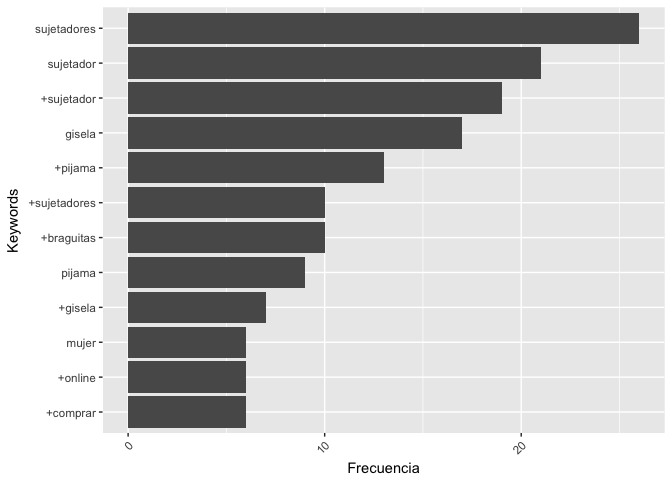

Informe datos GA
================
@jrcajide
11/3/2017

Gisela
======

Instalación y carga de librerías
--------------------------------

Extracción de datos de Google Analytics (GA)
--------------------------------------------

| keyword                         |  sessions|  bounces|
|:--------------------------------|---------:|--------:|
| (automatic matching)            |         9|        6|
| (content targeting)             |        36|       25|
| (not set)                       |        84|       34|
| (remarketing/content targeting) |       287|      125|
| +3 +push +up                    |         2|        1|
| +braguitas +algodon             |         2|        1|
| +braguitas +baratas             |         4|        1|
| +braguitas +blancas             |         3|        3|
| +braguitas +brasileñas          |        45|       21|
| +braguitas +gisela              |        10|        2|

Análisis de Kw
--------------

**Top 10 palabras más frecuentes**

    ## Selecting by freq

Palabras relacionadas con *sujetadores*:

**Palabras asociadas a `sujetadores`**

| keyword      |  frecuencia|
|:-------------|-----------:|
| aros         |        0.31|
| espalda      |        0.31|
| sin          |        0.31|
| escotes      |        0.26|
| para         |        0.26|
| con          |        0.19|
| novia        |        0.19|
| aire         |        0.18|
| baratos      |        0.18|
| bonitos      |        0.18|
| descubierta  |        0.18|
| nuevos       |        0.18|
| playtex      |        0.18|
| pronunciados |        0.18|

Exportar los datos
------------------

Los datos están ahora en el archivo [keywords\_2017-03-13.csv](keywords_2017-03-13.csv)
